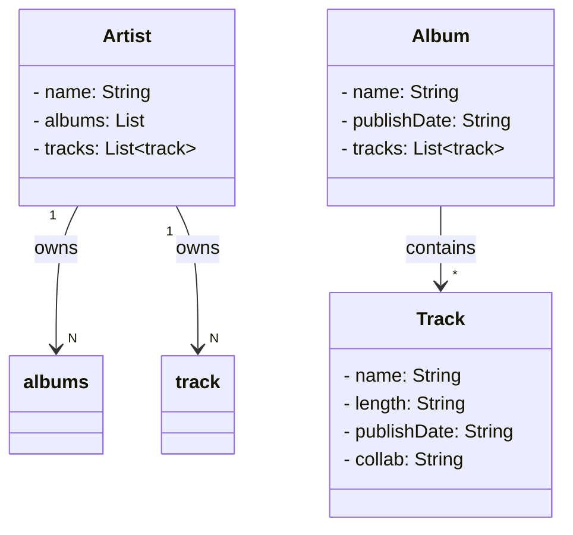

# Santander-Dev-Week-2023

Java RESTful API criada para a Santander Dev Week 2023.

Consiste em uma API com informações de artistas e suas canções. 

```mermaid
classDiagram
  class Artist {
    - name: String
    - albums: List<Album>
    - tracks: List<Track>
  }

  class Album {
    - name: String
    - publishDate: String
    - tracks: List<Track>
  }

  class Track {
    - name: String
    - length: String
    - publishDate: String
    - collab: String
  }


  Artist "1" --> "N" albums : owns
  Artist "1" --> "N" track : owns
  Album --> "*" Track : contains
```
